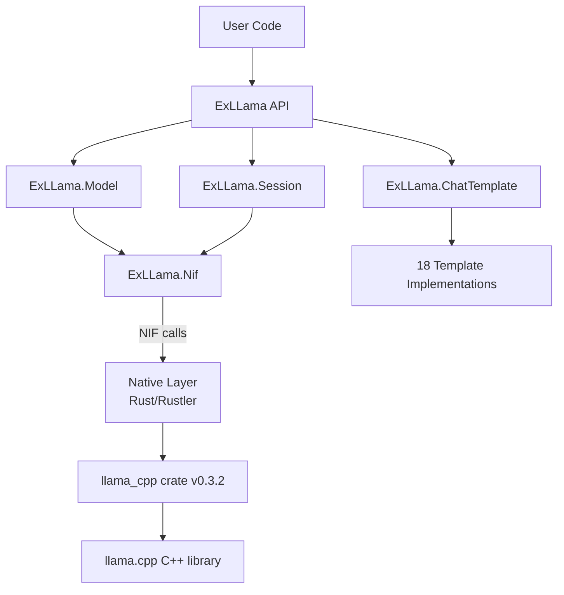

# Project Architecture

## Overview

ExLLama is an Elixir NIF wrapper for llama.cpp that enables loading and running GGUF-format Large Language Models from Elixir. It uses a two-layer architecture: an Elixir API layer providing model management, session handling, and chat templating, backed by a native layer that interfaces with llama.cpp for actual inference.

## System Diagram

## Core Components

| Component | Purpose |
|-----------|---------|
| `ExLLama` | Main API — convenience functions, chat completion orchestration |
| `ExLLama.Model` | Model loading from GGUF files, tokenization, embeddings, metadata |
| `ExLLama.Session` | Inference sessions — context management, sync/streaming completion |
| `ExLLama.ChatTemplate` | Behaviour + 18 implementations for formatting chat threads |
| `ExLLama.Nif` | NIF binding stubs — loads native library, declares all NIF functions |
| Native Layer | Rust NIF via Rustler — wraps llama_cpp crate with BEAM resource types |

## Data Flow

Model loading creates a `ResourceArc<ExLLamaModelRef>` wrapping a `LlamaModel`. Sessions wrap a `Mutex<LlamaSession>` in a `ResourceArc`. All NIF functions run on dirty CPU schedulers to avoid blocking the BEAM. Chat completion orchestrates: template formatting → session creation → context injection → inference → response extraction.

→ *See [arch/data-flow.md](arch/data-flow.md) for details*

## NIF Interface

The native layer exposes ~30 NIF functions across two domains: model operations (load, tokenize, decode, embeddings, special tokens, metadata) and session operations (context management, completion, deep copy). All are scheduled on `DirtyCpu`. Sessions use `Mutex<LlamaSession>` for thread safety; completions deep-copy the session before inference.

→ *See [arch/nif-interface.md](arch/nif-interface.md) for details*

## Chat Template System

Behaviour-based polymorphism with 18 format implementations. Template selection via `meta[:template]` option, defaulting to Zephyr. Each template implements `to_context/3` (format thread to string) and `extract_response/3` (parse model output to `GenAI.ChatCompletion`).

→ *See [arch/chat-templates.md](arch/chat-templates.md) for details*

## Key Decisions

- **Rust via Rustler**: Chosen for safe FFI to llama.cpp's C++ core via the `llama_cpp` Rust crate (v0.3.2)
- **Dirty CPU schedulers**: All NIFs use `DirtyCpu` to avoid blocking BEAM schedulers during inference
- **Mutex-wrapped sessions**: Sessions use `Mutex<LlamaSession>` for thread-safe access from multiple BEAM processes
- **Deep copy for completion**: Both sync and streaming completions deep-copy the session to avoid holding the mutex during long inference
- **GenAI Core integration**: Returns `GenAI.ChatCompletion` structs for standardized AI response types

## Technology Stack

| Layer | Technology |
|-------|------------|
| API | Elixir 1.19 / OTP 28 |
| NIF Bridge | Rustler 0.37 |
| ML Runtime | llama_cpp crate 0.3.2 → llama.cpp C++ |
| Model Format | GGUF |
| Test Model | TinyLlama 1.1B Chat Q4_K_M |
